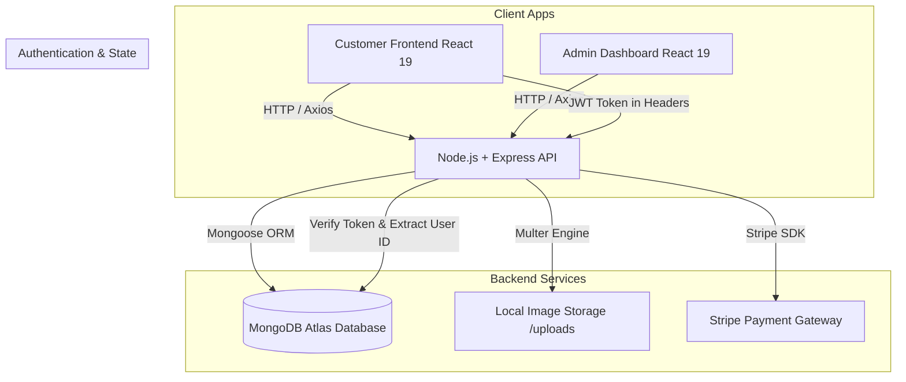

# 🍔 Relish — Modern Full-Stack Food Ordering & Admin Platform

<p align="center">
  
</p>

<p align="center">
  <strong>An enterprise-ready, full-stack food delivery application built with React 19, Vite, Node.js, Express, MongoDB, and Stripe integration.</strong>
</p>

<p align="center">
  <a href="#-key-features"></a>
  <a href="#-key-features"></a>
  <a href="#-key-features"></a>
  <a href="#-key-features"></a>
  <a href="#-key-features"></a>
  <a href="#-license"></a>
</p>

---

## 📖 Table of Contents
- [🌟 Project Overview](#-project-overview)
- [✨ Key Features](#-key-features)
  - [🛒 Customer Web App (Frontend)](#-customer-web-app-frontend)
  - [🛡️ Admin Control Panel](#️-admin-control-panel)
  - [⚡ Express & MongoDB Backend](#-express--mongodb-backend)
- [🏗️ System Architecture & Data Flow](#️-system-architecture--data-flow)
- [🎨 Showcase Sections & Highlights](#-showcase-sections--highlights)
- [🛠️ Tech Stack & Tooling](#️-tech-stack--tooling)
- [📂 Project Directory Structure](#-project-directory-structure)
- [⚙️ Environment Variables Setup](#️-environment-variables-setup)
- [🚀 Quick Start & Installation Guide](#-quick-start--installation-guide)
- [🔌 API Documentation](#-api-documentation)
- [🗄️ Database Schemas](#️-database-schemas)
- [📜 License](#-license)

---

## 🌟 Project Overview

**Relish** is a complete end-to-end food ordering platform crafted to deliver a seamless culinary experience. Designed with modern web standards, Relish bridges hungry customers with delicious meals while giving restaurant admins full operational control over food inventory, order processing, and delivery status updates.

### What Makes Relish Unique?
- **Unified Full-Stack Architecture**: Clean separation between customer app, admin dashboard, and REST API.
- **Real-Time Interactive UI**: Dynamic category filtering, instant live search, persistent cart state across reloads, and micro-animations.
- **Secure Authentication & Payments**: Token-based JWT authentication paired with Stripe Checkout for frictionless transactions.
- **Offline/Fallback Capabilities**: Seamless catalog fallback to ensure immediate visual showcase even before database setup.

---

## ✨ Key Features

### 🛒 Customer Web App (Frontend)
- **Hero & Category Exploration**: Interactive visual menu slider (Salads, Rolls, Desserts, Sandwich, Cake, Pure Veg, Pasta, Noodles).
- **Live Search & Filter**: Real-time instant search bar for dish name & description lookup.
- **Interactive Shopping Cart**: Dynamic subtotal computation, item quantity controls (+/-), and persistent state via Context API & local storage.
- **User Authentication**: Secure Sign Up & Login modal popup with JWT storage and session persistence.
- **Stripe Checkout Integration**: Seamless order checkout with dynamic address collection and Stripe payment gateway redirection.
- **Live Order Tracking ("My Orders")**: Track real-time order status updates (Food Processing -> Out for delivery -> Delivered).
- **About Us & Feature Showcase**: Built-in brand story, impact metrics (50+ Dishes, 30 Min Delivery, 4.9★ Rating), and core value pillars.
- **Responsive Layout**: Designed to look stunning across desktop, tablet, and mobile browsers.

### 🛡️ Admin Control Panel
- **Food Catalog Management**: Add new food items with custom images (Multer file upload), descriptions, prices, and category tags.
- **Inventory List & Deletion**: View all active food items in a structured grid with instant delete capabilities.
- **Order Management Dashboard**: Monitor incoming customer orders, review itemized order contents, customer address details, and update live fulfillment statuses.
- **Toast Notifications**: Interactive status feedback powered by React-Toastify.

### ⚡ Express & MongoDB Backend
- **RESTful Endpoints**: Modular controllers and routes for `/api/food`, `/api/user`, `/api/cart`, `/api/order`.
- **MongoDB Atlas Integration**: Schemas built with Mongoose ORM ensuring strict data typing and relationship mapping.
- **Middleware Infrastructure**: 
  - `authMiddleware` for validating JWT headers on protected cart & order routes.
  - `multer` image upload storage engine.
  - `cors` cross-origin resource sharing.
- **Payment Processing**: Stripe Checkout API session creation & verify verification callback handlers.

---

## 🏗️ System Architecture & Data Flow



---

## 🎨 Showcase Sections & Highlights

### 1. Interactive Menu & Category Filtering
Users can click through curated categories or search by keyword to filter delicious dishes dynamically.

### 2. About Relish Section
Presents the brand narrative, core values (Fresh Ingredients, Express Delivery, Secure Checkout, Master Chefs), and key performance statistics.

### 3. Integrated Cart & Checkout Pipeline
- State managed through React Context API (`StoreContext`).
- Auto-syncs cart contents to backend database when user is authenticated.
- Stripe payment session link generation for instant payment handling.

### 4. Admin Management Dashboard
Direct control panel for restaurant staff to manage menu items and update order statuses in real time.

---

## 🛠️ Tech Stack & Tooling

| Domain | Technology / Library | Description |
| :--- | :--- | :--- |
| **Frontend Framework** | React 19.2.4 + Vite 8 | Fast SPA rendering & modern UI |
| **Routing** | React Router DOM 7.14 | Client-side routing (`/`, `/cart`, `/order`, `/myorders`) |
| **State Management** | React Context API | Global state for food catalog, cart items, user token |
| **Styling** | Vanilla CSS3 + Google Fonts | Custom CSS design system, glassmorphism, responsive grid |
| **Backend Runtime** | Node.js + Express.js | Event-driven backend REST API |
| **Database** | MongoDB Atlas + Mongoose | Cloud NoSQL database with structured schemas |
| **Authentication** | JSON Web Token (JWT) + Bcrypt | Secure password hashing & stateless auth |
| **File Uploads** | Multer | Disk storage engine for food image uploads |
| **Payments** | Stripe API | International payment processing & session verification |
| **Admin UI Tools** | React Toastify + Axios | Admin feedback toasts & asynchronous HTTP requests |

---

## 📂 Project Directory Structure

```
Relish/
├── README.md                          # Main project documentation (this file)
├── backend/                           # Express.js REST API server
│   ├── config/
│   │   └── db.js                      # MongoDB connection script
│   ├── controllers/
│   │   ├── cartController.js          # Add, remove, get user cart items
│   │   ├── foodController.js          # Add food, list foods, remove food
│   │   ├── orderController.js         # Place order, verify order, user orders, status update
│   │   └── userController.js          # User login & registration with JWT
│   ├── middleware/
│   │   └── auth.js                    # JWT verification middleware
│   ├── models/
│   │   ├── foodModel.js               # Food item schema
│   │   ├── orderModel.js              # Order schema (address, items, status, payment)
│   │   └── userModel.js               # User schema with cartData object
│   ├── routes/
│   │   ├── cartRoute.js
│   │   ├── foodRoute.js
│   │   ├── orderRoute.js
│   │   └── userRoute.js
│   ├── uploads/                       # Saved food images
│   ├── .env                           # Backend environment variables
│   ├── .env.example                   # Environment template
│   ├── server.js                      # Main backend server entry point
│   └── package.json
│
├── frontend/                          # Customer web application
│   ├── src/
│   │   ├── assets/                    # Images, icons, and fallback catalog data
│   │   ├── components/
│   │   │   ├── AboutUs/               # About section component & styles
│   │   │   ├── WhyUs/                 # Why Choose Relish feature highlights
│   │   │   ├── ExploreMenu/           # Category filter component
│   │   │   ├── FoodDisplay/           # Filtered food cards grid & search
│   │   │   ├── Fooditem/              # Individual food item card
│   │   │   ├── Header/                # Hero banner & CTA
│   │   │   ├── Loginpopup/            # Auth modal (Sign in / Sign up)
│   │   │   └── Navbar/                # Top navbar with search toggle & badge
│   │   ├── context/
│   │   │   └── storecontext.jsx       # Global context provider
│   │   ├── Footer/                    # Footer component & App download banner
│   │   ├── pages/
│   │   │   ├── Cart/                  # Cart view & subtotal calculation
│   │   │   ├── Home/                  # Main landing page
│   │   │   ├── MyOrders/              # User order history & status tracking
│   │   │   ├── PlaceOrder/            # Order placement & address form
│   │   │   └── Verify/                # Stripe payment verification handler
│   │   ├── App.jsx                    # App route definitions & layout
│   │   └── main.jsx                   # Entry point with BrowserRouter & Context
│   └── package.json
│
└── admin/                             # Restaurant admin dashboard
    ├── src/
    │   ├── components/                # Navbar & Sidebar components
    │   ├── pages/
    │   │   ├── Add/                   # Add new dish page with file upload
    │   │   ├── List/                  # Dish inventory management & delete
    │   │   └── Orders/                # Live order status manager
    │   ├── App.jsx
    │   └── main.jsx
    └── package.json
```

---

## ⚙️ Environment Variables Setup

Create a `.env` file in the `backend/` directory based on `backend/.env.example`:

```env
# Server Port
PORT=5000

# MongoDB Password / Connection String
MONGODB_PASSWORD=your_mongodb_password

# JWT Secret Key
JWT_SECRET=your_super_secret_jwt_key

# Stripe Secret Key
STRIPE_SECRET_KEY=sk_test_your_stripe_secret_key
```

---

## 🚀 Quick Start & Installation Guide

### Prerequisites
- **Node.js**: v18.0.0 or higher
- **npm**: v9.0.0 or higher
- **MongoDB Atlas** database account or local MongoDB instance

---

### Step 1: Clone the Repository
```bash
git clone https://github.com/jaiswalabhishek377/Relish.git
cd Relish
```

---

### Step 2: Start Backend Server
```bash
cd backend
npm install
npm start
# Server starts at http://localhost:5000
```

---

### Step 3: Start Customer Frontend Web App
Open a new terminal window:
```bash
cd frontend
npm install
npm run dev
# Frontend runs at http://localhost:5173
```

---

### Step 4: Start Admin Control Panel
Open a third terminal window:
```bash
cd admin
npm install
npm run dev
# Admin dashboard runs at http://localhost:5174 (or next available port)
```

---

## 🔌 API Documentation

### 🍕 Food Endpoints (`/api/food`)
| Method | Endpoint | Description | Auth Required |
| :--- | :--- | :--- | :--- |
| `POST` | `/api/food/add` | Add a new food item (with image upload) | No |
| `GET` | `/api/food/list` | Fetch all available food items | No |
| `POST` | `/api/food/remove` | Delete a food item by ID | No |

### 👤 User Auth Endpoints (`/api/user`)
| Method | Endpoint | Description | Auth Required |
| :--- | :--- | :--- | :--- |
| `POST` | `/api/user/register` | Register new user account | No |
| `POST` | `/api/user/login` | User login (returns JWT token) | No |

### 🛒 Cart Endpoints (`/api/cart`)
| Method | Endpoint | Description | Auth Required |
| :--- | :--- | :--- | :--- |
| `POST` | `/api/cart/add` | Add item to user cart | Yes (Token) |
| `POST` | `/api/cart/remove` | Decrease/remove item from cart | Yes (Token) |
| `POST` | `/api/cart/get` | Fetch current user cart items | Yes (Token) |

### 📦 Order Endpoints (`/api/order`)
| Method | Endpoint | Description | Auth Required |
| :--- | :--- | :--- | :--- |
| `POST` | `/api/order/place` | Place new order & generate Stripe payment session | Yes (Token) |
| `POST` | `/api/order/verify` | Verify Stripe payment success / failure | No |
| `POST` | `/api/order/userorders` | Fetch authenticated user's order history | Yes (Token) |
| `GET` | `/api/order/list` | Admin: List all customer orders | No |
| `POST` | `/api/order/status` | Admin: Update order status (Food Processing -> Delivered) | No |

---

## 🗄️ Database Schemas

### User Schema (`userModel.js`)
```javascript
{
  name: { type: String, required: true },
  email: { type: String, required: true, unique: true },
  password: { type: String, required: true },
  cartData: { type: Object, default: {} }
}
```

### Food Schema (`foodModel.js`)
```javascript
{
  name: { type: String, required: true },
  description: { type: String, required: true },
  price: { type: Number, required: true },
  image: { type: String, required: true },
  category: { type: String, required: true }
}
```

### Order Schema (`orderModel.js`)
```javascript
{
  userId: { type: String, required: true },
  items: { type: Array, required: true },
  amount: { type: Number, required: true },
  address: { type: Object, required: true },
  status: { type: String, default: "Food Processing" },
  date: { type: Date, default: Date.now() },
  payment: { type: Boolean, default: false }
}
```

---

## 📜 License

This project is open source and available under the [MIT License](LICENSE).

<p align="center">
  Crafted with ❤️ by the Relish Development Team.
</p>
